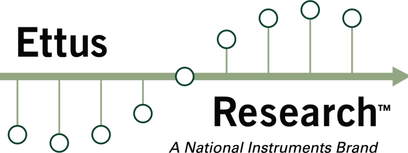
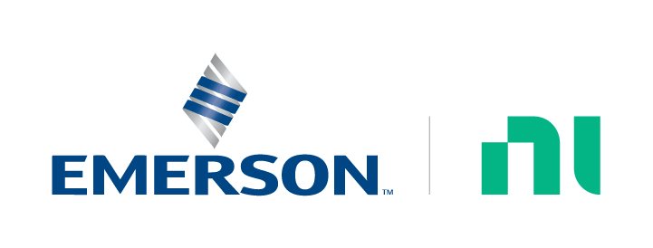

 
---

# NI LabVIEW - USRP Examples

## Overview

This repository contains various example applications which demonstrate how to 
use NI LabVIEW with USRP devices via the USRP Hardware Driver (UHD) APIs. These
examples serve as a starting point for developing your own LabVIEW applications
that interact with USRP hardware, including support for RF Network-on-Chip (RFNoC)
features. By leveraging these examples, users can quickly get up and running with 
USRP devices in LabVIEW and extend the provided code to suit their specific needs.

## List of Examples

- [tx-rx-loopback](./tx-rx-loopback/)

## Dependencies

- [NI LabVIEW](https://www.ni.com/en/shop/labview.html) 
2024 or newer (2025 Q3, 64 bit recommended)
- [Python](https://www.python.org) 3.10 or 3.12 with the same bitness as LabVIEW
- [USRP Hardware Driver (UHD)](https://files.ettus.com/binaries/uhd/latest_release/) 
4.8.0 or newer (binary Windows installer)
- [UHD Python API](https://pypi.org/project/uhd/) package 4.8.0 or newer (Python Wheel)

Note: The [NI-USRP](https://www.ni.com/en/support/downloads/drivers/download.ni-usrp.html) 
Driver for LabVIEW is not required for these examples.

## Hardware setup

LabVIEW USRP examples are focussing on [PXI](https://www.ni.com/en/shop/pxi.html) 
based systems, configured with an Embedded Controller running Windows 10 or 11 
operating system. To interface with USRP devices, PXI-based 
[Ethernet Interface Modules](https://www.ni.com/en-gb/shop/category/gpib-serial-and-ethernet.html?productId=139226) 
are required.

More specific hardware-related information can be found within the respective
[example](#list-of-examples) folder.

## Software setup

NI LabVIEW should be installed via the NI Package Manager. Pick and choose a 
version that satisfies the [dependency](#dependencies) requirement. For Python, 
please refer to the installation instructions at https://www.python.org and 
also make sure the Python version satisfies the [dependency](#dependencies) 
requirement. The USRP Hardware Driver (UHD) needs to be installed following 
these instructions from the [USRP Manual](https://files.ettus.com/manual/page_install.html#install_win).

## Debugging

- Turn LV Python console on by adding the following key to the LabVIEW.ini
  - `ShowConsoleForPythonNode=TRUE`
- For more advanced debugging of Python Code called from LabVIEW Python Node see 
this [Link](https://knowledge.ni.com/KnowledgeArticleDetails?id=kA03q0000019hP1CAI)

## References

- [LabVIEW Python Node user manual](https://www.ni.com/en/support/documentation/supplemental/18/installing-python-for-calling-python-code.html)
- [UHD Python API user manual](https://files.ettus.com/manual/page_python.html)
- [UHD Python API Knowledge base](https://kb.ettus.com/UHD_Python_API)
- [UHD RFNoC user manual](https://files.ettus.com/manual/page_properties.html)
- [UHD RFNoC API](https://files.ettus.com/manual/group__rfnoc__blocks.html)
- [UHD RFNoC Knowledge base](https://kb.ettus.com/Getting_Started_with_RFNoC_in_UHD_4.0)

## Limitations

- **LabVIEW** - Currently Python object refnum can only be used 2^20 
times per VI execution [(reference)](https://forums.ni.com/t5/LabVIEW/Python-object-refnum-can-only-be-used-2-20-times/m-p/4404515)
- **Throughput, Host to USRP** - Compared to pure data streaming using 
Linux-based host computers and command line applications based on UHD, 
the overall throughput on Windows using LabVIEW is limited to a few MS/s.

## Bugs / Feature Requests

To report a bug or submit a feature request, please use the
[GitHub issues page](https://github.com/ni/labview-usrp-examples/issues).

## License

**labview-usrp-examples** are licensed under an MIT-style license, see
[LICENSE](https://github.com/ni/labview-usrp-examples/blob/main/LICENSE) for more details.