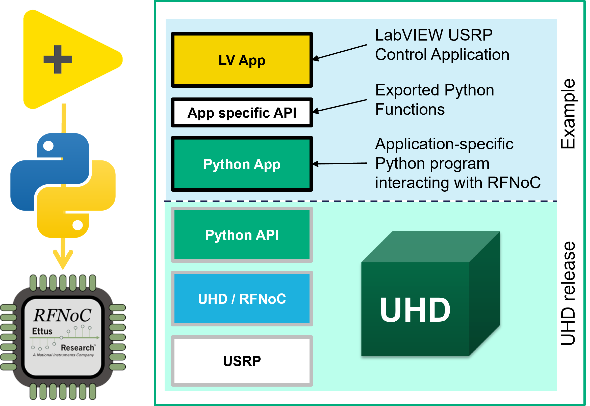

 
---

# Interfacing UHD-based USRPs from LabVIEW Host

## Overview

This repository contains various example applications which demonstrate how to 
use NI LabVIEW with USRP devices via the USRP Hardware Driver (UHD) APIs. 
The main focus is to show how to interface and configure USRPs from LabVIEW. 
For data streaming it is recommended to implement an architecture based on 
Remote Streaming. These examples serve as a starting point for developing your 
own LabVIEW applications that interact with USRP hardware, including support
for RF Network-on-Chip (RFNoC) features. By leveraging these examples, users 
can quickly get up and running with USRP devices in LabVIEW and extend the 
provided code to suit their specific needs.

Supported USRPs are the RFNoC enabled devices, which are the USRP X4x0 series, 
and all the Generation-3 USRPs in the X series (X3xx), E series (E3xx) 
and N series (N3xx). For more information about devices used for testing the 
examples, please refer to the documentation located in each example folder.

## List of Examples

- [tx-rx-loopback](./tx-rx-loopback/) - Example for Tx/Rx Loopback using Python/RFNoC UHD API

## Architecture

### Software Stack

 

The examples situated in this git repository are built on top of the released 
USRP Hardware Driver (UHD). In UHD, **Python APIs** provide access to 
interface with the **USRP** at high-level (Multi-USRP API) or more granular 
level (**RFNoC** API). The latter we use to implement the application-specific 
functionality as a Python program. This **Python App** abstracts the granular 
RFNoC implementation by common Python functions as **App specific API**. 
These are called from the top level USRP Control application (**LV App**) which 
finally integrates the RFNoC based USRP into the 
[LabVIEW](https://www.ni.com/en/shop/labview.html) environment.
Most of the examples only have one Python (\*.py) and one LabVIEW (\*.vi) file 
which can be used as a simple starting point to develop your own application. 
Refer to the [Dependencies](#dependencies) section for details on the required 
UHD software release.

### General Workflow

The typical workflow for developing LabVIEW applications with USRP Python API 
integration involves the following steps:

1. **Start with a pure Python implementation**
  - To get functionality working first, start with a Python-only application 
  which interfaces the USRP using e.g. RFNoC API.
  - Verify operation on the command line.

2. **Refactor and modularize Python code**  
  - Re-organize the code from 1. to useful, application-specific API subfunctions.
  - It's recommended to implement session-specific information as an object, 
  which can be used by those API subfunctions.
  - Test the call sequence of these subfunctions within the Python main function
   to ensure correctness.

3. **Integrate with LabVIEW**  
  - Use the LabVIEW Python Node, which allows LabVIEW to execute Python scripts 
  and interact with Python functions, to call the app-specific Python API 
  functions created in 2. directly from your LabVIEW application. For more details, 
  refer to the [LabVIEW Python Node documentation](https://www.ni.com/docs/en-US/bundle/labview-api-ref/page/functions/python-node.html).
  - The input parameter `function name` of the Python Node needs to correspond 
  to the respective function name specified in the Python implementation. 
  See the figure below for more details:
  

### Software Design Considerations 

When using the Python programming language in LabVIEW, the following design 
principles should be considered
- When handing over data buffers to Python use the `Marshal to NumPy Array` 
option for these inputs as described 
[here](https://www.ni.com/docs/en-US/bundle/labview-api-ref/page/functions/python-node.html#d616193e358)
- For referencing LabVIEW clusters in Python use the `Marshal to Named Tuple` 
option for those inputs as described 
[here](https://www.ni.com/docs/en-US/bundle/labview-api-ref/page/functions/python-node.html#d616193e379)
- Prevent parallel running processing loops in LabVIEW which call into Python due to Python's 
[Global Interpreter Lock (GIL)](https://docs.python.org/3/c-api/init.html#thread-state-and-the-global-interpreter-lock) 
which can drastically impact the performance of your program.
- Make sure that no GUI elements like controls and indicators are updated within 
the same loop which calls into Python due to the negative performance impact. 
Offload these updates to a separate loop using LabVIEW 
[Channel Wires](https://www.ni.com/en/support/documentation/supplemental/16/channel-wires.html). 

## Hardware Setup

LabVIEW USRP examples are focussing on [PXI](https://www.ni.com/en/shop/pxi.html) 
based systems, configured with an Embedded Controller running Windows 10 or 11 
operating system. To interface with USRP devices, PXI-based 
[Ethernet Interface Modules](https://www.ni.com/en-gb/shop/category/gpib-serial-and-ethernet.html?productId=139226) 
are required.

More specific hardware-related information can be found within the respective
[example](#list-of-examples) folder.

## Software Setup

### Dependencies
- [NI LabVIEW](https://www.ni.com/en/shop/labview.html) 
2024 or newer (2025 Q3, 64 bit recommended)
- [Python](https://www.python.org) 3.10 or 3.12 with the same bitness as LabVIEW
- [USRP Hardware Driver (UHD)](https://files.ettus.com/binaries/uhd/latest_release/) 
4.8.0 or newer (binary Windows installer)
- [UHD Python API](https://pypi.org/project/uhd/) package 4.8.0 or newer (Python Wheel)

Note: The [NI-USRP](https://www.ni.com/en/support/downloads/drivers/download.ni-usrp.html) 
Driver for LabVIEW is not required for these examples.

### Installation

NI LabVIEW should be installed via the NI Package Manager. Pick and choose a 
version that satisfies the dependency requirement. For Python, 
please refer to the installation instructions at https://www.python.org and 
also make sure the Python version satisfies the dependency requirement. 
The USRP Hardware Driver (UHD) needs to be installed following 
these instructions from the [USRP Manual](https://files.ettus.com/manual/page_install.html#install_win).

## Debugging

- Turn LV Python console on by adding the following key to the LabVIEW.ini
  - `ShowConsoleForPythonNode=TRUE`
- For more advanced debugging of Python Code called from LabVIEW Python Node see 
this [Link](https://knowledge.ni.com/KnowledgeArticleDetails?id=kA03q0000019hP1CAI)

## Limitations

- **LabVIEW** - Currently Python object refnum can only be used 2^20 times per VI execution 
[(reference)](https://forums.ni.com/t5/LabVIEW/Python-object-refnum-can-only-be-used-2-20-times/m-p/4404515).
This means for instance, you can execute a while loop that calls a Python Node 
which uses a object refernce only 2^20 times before it returns with an error.
- **Throughput, Host to USRP** - The IQ data streaming throughput between LV 
host application and USRP device is limited to a few MS/s only.

## Bugs / Feature Requests

To report a bug or submit a feature request, please use the
[GitHub issues page](https://github.com/ni/labview-usrp-examples/issues).

## License

**labview-usrp-examples** are licensed under an MIT-style license, see
[LICENSE](https://github.com/ni/labview-usrp-examples/blob/main/LICENSE) for more details.

## References

- [LabVIEW Python Node user manual](https://www.ni.com/en/support/documentation/supplemental/18/installing-python-for-calling-python-code.html)
- [UHD Python API user manual](https://files.ettus.com/manual/page_python.html)
- [UHD Python API Knowledge base](https://kb.ettus.com/UHD_Python_API)
- [UHD RFNoC user manual](https://files.ettus.com/manual/page_properties.html)
- [UHD RFNoC API](https://files.ettus.com/manual/group__rfnoc__blocks.html)
- [UHD RFNoC Knowledge base](https://kb.ettus.com/Getting_Started_with_RFNoC_in_UHD_4.0)
- [UHD Remote Streaming](https://files.ettus.com/manual/page_stream.html#stream_remote)