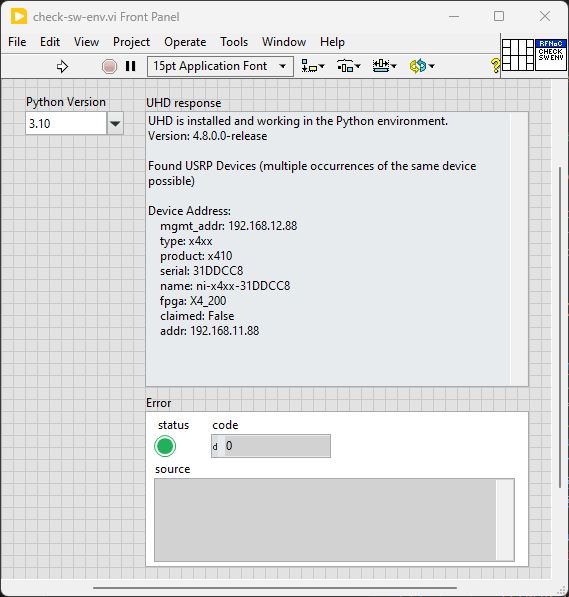

# Example for checking the Software Environment
## Overview
This example checks if the UHD Python module is installed and working 
correctly. It queries the UHD version and lists any connected USRP 
devices. This is useful for ensuring that the UHD software environment 
is set up correctly.

More detailed information can be found in the in-code documentation of the
example.

## Software Setup
- Make sure that software [dependencies](../README.md#dependencies) are satisfied.
- Install required software as described in the section 
[software-setup](../README.md#software-setup).

## Run the Example
- Make sure that you have both the VI and Python file in the same directory.
- Open the VI using LabVIEW and adjust the `Python Version` to your installation.
- Run the Example.
- Check the output of `UHD response` field, see the figure below for reference.

## Example Front Panel
