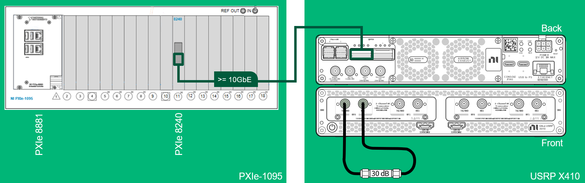
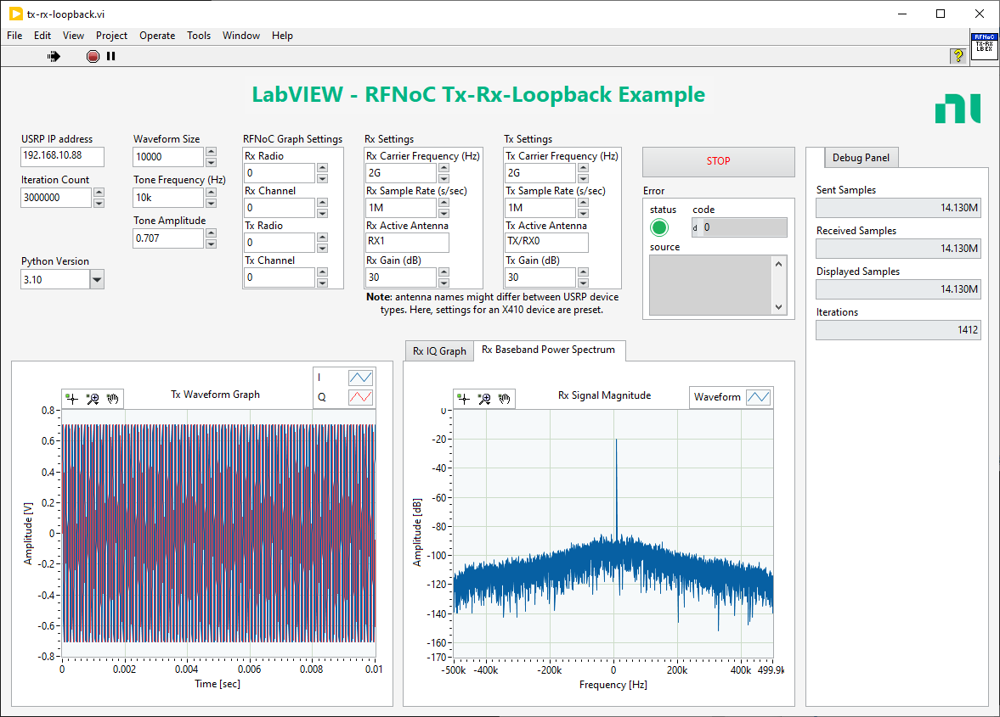
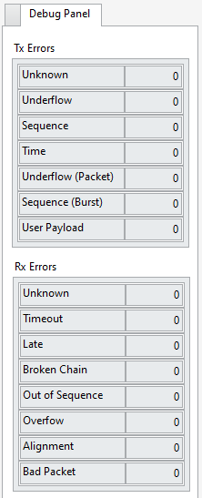

# Example for Tx/Rx Loopback using Python/RFNoC UHD API
## Overview
This example shows how to set up a basic Tx/Rx loopback and stream data using
RF Network-on-chip (RFNoC). It uses the UHD RFNoC API for Python to configure
the USRP device, stream data from the LabVIEW host to the USRP transmitter, 
loop it back to the USRP receiver and transfer the data back to the 
LabVIEW host. Main focus here is clearly on the configuration of an RFNoC 
capable USRP using LabVIEW Python nodes. Streaming is possible, but can be 
only considered for low data rates. For high-data rate streaming it is 
recommended to implement an architecture based on 
[Remote Streaming](https://files.ettus.com/manual/page_stream.html#stream_remote) 
provided by USRP Hardware Driver (UHD).

More detailed implementation-specific information can be found in the in-code
documentation see [tx_rx_loopback.py](./tx-rx-loopback.py).

Devices used for testing this example are USRP X410, USRP X440 and USRP N310. 
Other RFNoC enabled USRP devices are expected to work as well, 
see listing for supported USRPs in main [Overview](../README.md#overview) section.

## Hardware Setup
The following description refers to the use of an USRP X410 device. Other USRP
devices like the USRP X440 or USRP N3x0 can also be integrated. Due to 
throughput limitations this example requires FPGA images which contain digital 
up conversion (DUC) and digital down conversion (DDC) functionality in Tx and Rx, 
respectively.
For device-specific settings, please refer to the 
[USRP Manual](https://files.ettus.com/manual/).  

The reference setup for this example consists of the following components:
- PXIe-1095 Chassis
- PXIe-8881 Embedded Controller
- PXIe-8240 Ethernet Interface Module or 
[similar](https://www.ni.com/en-gb/shop/category/gpib-serial-and-ethernet.html?productId=139226) 
supporting 10 Gigabit or more
- USRP X410 with X4_200 FPGA image

Make sure that the USRP device QSFP28 Port 0 is directly connected via a 
QSFP28 cable to the PXIe Ethernet Interface Module. Prepare the USRP to be 
compatible with the UHD version installed before (e.g. 4.8.0) by
- [updating the filesystem](https://files.ettus.com/manual/page_usrp_x4xx.html#x4xx_updating_filesystems)
- [updating the FPGA image](https://files.ettus.com/manual/page_usrp_x4xx.html#x4xx_updating_fpga)

For Tx-Rx loopback operation, connect a Tx port to an Rx port using an
SMA cable and a 30dB attenuator (e.g. TX/RX 0 -> RX1 of RF 0, daughterboard 0).

Example configuration:

## Software Setup
- Make sure that software [dependencies](../README.md#dependencies) are satisfied.
- Install required software as described in the section 
[software-setup](../README.md#software-setup).

## Check Connectivity
Make sure that both the PXIe Windows Controller and USRP have IP addresses
in the same subnet. To assign a static IP address to the USRP QSFP28 ports,
refer to these [instructions](https://files.ettus.com/manual/page_usrp_x4xx.html#x4xx_getting_started_network_connectivity).
Remember the IP address of the configured interface e.g. sfp0, QSFP28 0 
(4-lane interface or lane 0). To verify network connectivity of your USRP, 
please refer to the USRP Manual section for [Device Identification](https://files.ettus.com/manual/page_identification.html).
To prove the complete software environment including LabVIEW and Python, 
please refer to the [check-sw-env](../check-sw-env/) example.

## Run the Example
- Make sure that you have both the VI and Python file in the same directory.
- Open the VI using LabVIEW and enter the IPv4 address of the configured QSFP28 port of the USRP into the `USRP IP address` field.
- Adjust the `Python Version` to your installation.
- On the `RFNoC graph settings` ensure the default settings on the LabVIEW front panel and the cable connections in the HW diagram match (e.g. keep all `0` if you have connected TX/RX 0 -> RX1 of RF 0, daughter board 0).
- Adjust the `Rx Active Antenna`, e.g. to `RX1`, and `Tx Active Antenna`, e.g. to `TX/RX0`.
- Adjust the `Rx Gain` and `Tx Gain` settings to your needs.
- Run the Example.
- The `Tx Waveform Graph` should now be visible under `Received Signal`.

### Example Front Panel

## Verify Operation
To verify proper operation it is recommended to inspect the flow control error counters 
for Tx and Rx direction located on the `Debug Panel` of the Front Panel. Proper operation 
is defined as all counter values being `0`. For more information about these counters
please refer to the USRP Manual sections:
- Tx Error Counters - [event_code_t](https://files.ettus.com/manual/structuhd_1_1async__metadata__t.html#a2be1b5c0351746c78fa3bcb74a8ff5da)
- Rx Error Counters - [error_code_t](https://files.ettus.com/manual/structuhd_1_1rx__metadata__t.html#ae3a42ad2414c4f44119157693fe27639)

